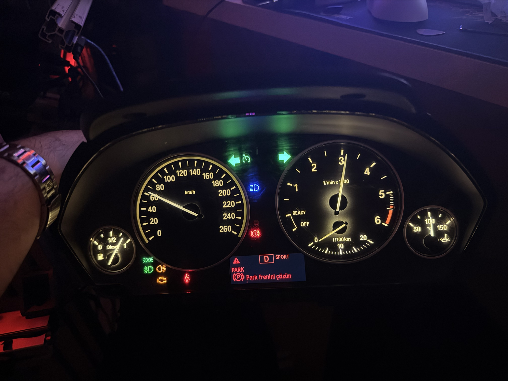

# BMW F30 instrument cluster for SimHub

A real BMW F30 instrument cluster on the desk, driven by an Arduino Nano + MCP2515
over CAN and fed live from your games through **SimHub**. Every needle, lamp and most of
the MID display react to the game.

This is not a copy-paste of an existing cluster sketch. The CAN messages, CRC seeds,
scalings and check-control codes were worked out on this exact cluster (KOMBI, CAFD
0760) with a webcam pointed at it, one experiment at a time. The full log of what was
tried, what failed and why is in [`docs/HISTORY.md`](docs/HISTORY.md).

## What works

| Area | Details |
|---|---|
| Gauges | Speed, RPM, fuel, oil temperature, l/100km needle |
| Gear / mode | P R N D and DS with gear number, drive modes (Traction, Comfort, Sport, Sport+, DSC off, Eco Pro) |
| Lamps | Turn signals, hazards, high beam, lights-on, fog, cruise control, parking brake, seatbelt, engine MIL, DSC, low brake-air pressure |
| MID display | Page button and long-press trip reset, consumption unit, Turkish / German / English language, clock and date from the PC |
| Trip computer | Average consumption and range that agree with the game (fuel counter matched to the real fuel use) |
| Fuel | Refuelling moves the needle straight to the new level (the cluster's own heavy damping is worked around) |
| Game warnings | Damage, engine fault, differential lock, trailer attach/detach, tyre wear, low fuel, speed > 100 / > 120 km/h popups |
| Backlight | Always on, or tied to the game's lights (`backlightAlwaysOn`) |
| Extras | Optional PC-side BMW-style gong for warnings (`tools/gong`) |

Open items (help welcome): cruise set-speed marker, speed-limit sign (SLI), low-beam icon
(this cluster has none), outside temperature (a physical sensor input, not CAN).

## Hardware

- Real BMW F30/F3x analog instrument cluster with a 12 V supply
- Arduino Nano + MCP2515 CAN module (**8 MHz crystal**), 500 kbps CAN
- Cluster connector: pins 1, 2, 11 = 12 V · 7, 8 = GND · 6 = CAN-H · 12 = CAN-L
- Arduino is USB powered; only GND is shared with the cluster's 12 V supply

| Arduino pin | Function |
|---|---|
| D2 | MCP2515 INT |
| D4 | MID page button (hold = reset the trip value on the current page) |
| D5 | Drive mode cycle |
| D6 | Consumption unit cycle (l/100km / mpg / km/l) |
| D7 | Seatbelt buckle switch (to GND when buckled) |
| D10–D13 | MCP2515 CS / SPI |

MCP2515 → Nano: VCC → **5V** (not RST, it is right next to it), GND → GND, CS → D10,
SO → D12, SI → D11, SCK → D13, INT → D2.

The cluster's own trip button is read back over CAN (`0x5E0`) and appears in SimHub as
Button 1.

## Setup

1. Install the libraries in [`firmware/LIBRARIES.md`](firmware/LIBRARIES.md).
2. Open `firmware/bmw_f30_cluster/bmw_f30_cluster.ino`, board **Arduino Nano**, upload.
   Close SimHub first (it holds the COM port), and close it from its own window: a
   force-kill can lose an unsaved formula.
3. In SimHub add a **Custom Serial Device**, 19200 baud, and paste
   [`simhub/custom_protocol.txt`](simhub/custom_protocol.txt) as the protocol message.
   It must stay at exactly 54 fields in the order `SHCustomProtocol::read()` expects.
4. Options at the top of `bmw_f30_cluster.ino`: `setlanguage` (0 = Turkish, 1 = German,
   2 = English), `backlightAlwaysOn`, `nightThemeWithLights`, `drivemod`, `setkmormiles`,
   `GRPMOND` (diesel cluster with a petrol RPM disc).

### Which games?

The firmware only sees the 54 values SimHub sends, so it works with any game SimHub
supports. In `simhub/custom_protocol.txt`:

The formula picks the right source per game (`DataCorePlugin.CurrentGame`):

| | ETS2 / ATS | Assetto Corsa / ACC and other games | BeamNG.drive |
|---|---|---|---|
| Speed, RPM, gear, fuel, oil temp, ignition, clock | ✓ | ✓ (SimHub common data) | ✓ |
| Turn signals / hazards | ✓ | ✓ SimHub `TurnIndicatorLeft/Right` | ✓ |
| Lights / high beam | ✓ | ACC: `Graphics.LightsStage` (AC has no light data) | ✓ |
| Parking brake | ✓ | Handbrake lever > 50 % | ✓ |
| Cruise icon | Cruise control | Pit limiter | – |
| Brake air, damage, trailer, tyre wear warnings | ✓ | – | – |

- Assetto Corsa / ACC support was added on 2026-10-08 and has not been tested in game yet.
  If a lamp stays dark, check the property in SimHub's *Available properties* while the
  game runs and adjust `simhub/custom_protocol.txt`.
- BeamNG.drive: also copy `simhub/beamng/simhubextras.lua` to
  `BeamNG.drive\lua\vehicle\extensions\auto` (doors, hood, trunk, cruise).

## Cluster seems dead?

Flash [`tools/bench/alltest`](tools/bench/alltest) (no SimHub needed). It lights every
lamp, puts the needles at 100 km/h / 5000 rpm and prints CAN health once a second at
115200 baud:

| Serial output | Meaning |
|---|---|
| `ok` rising, `err=0` | Everything fine |
| `TEC=128 REC=0` | Module OK, but nothing on the bus answers: cluster unpowered or CAN wires open |
| `TEC=0 REC≈128` | Bus stuck dominant: MCP2515 VCC not on 5V, or CAN-L pulled low (check connectors) |

`tools/bench/candiag` (listen-only bitrate scan) and `tools/bench/loopdiag` (MCP2515
internal loopback) narrow it down further.

## Repository map

| Path | What it is |
|---|---|
| `firmware/bmw_f30_cluster/` | Main Arduino sketch (`SHCustomProtocol.h` has all the CAN logic) |
| `simhub/` | SimHub formula, BeamNG Lua, old formulas |
| `docs/HISTORY.md` | Full dated development log |
| `docs/RESEARCH.md` | CAN research notes, check-control code list (Turkish texts), open items |
| `docs/cc_atlas/` | Photo atlas of ~580 check-control codes on this cluster |
| `docs/images/` | Highlights, LED swap before/after, PCB photo |
| `docs/archive/` | Session backups (fuel tests, SLI scan logs, SimHub configs) |
| `tools/bench/` | Standalone test and diagnostic sketches |
| `tools/cc_scanner/` | Webcam-driven scanners (check-control codes, fuel, gears, UDS) with their logs |
| `tools/gong/` | PC-side warning gong through SimHub's web API |
| `CLAUDE.md` | Condensed rules and current state |

## Türkçe özet

Gerçek bir BMW F30 gösterge panelini Arduino Nano + MCP2515 ile CAN üzerinden
sürüp SimHub aracılığıyla oyunlara bağlayan proje. İbreler, ikaz lambaları, vites,
sürüş modları, saat, ortalama tüketim / menzil, yakıt doldurma ve oyun uyarıları
çalışıyor. Formül oyunu kendisi tanır: ETS2/ATS, Assetto Corsa/ACC, BeamNG ve SimHub'ın
desteklediği diğer oyunlar (hangi lambanın hangi oyunda çalıştığı *Which games?*
tablosunda). Bütün CAN çözümleri bu göstergenin üzerinde kamera ile
tek tek denenerek bulundu; ayrıntılar `docs/HISTORY.md` ve `docs/RESEARCH.md` içinde.
Kurulum için yukarıdaki *Setup* adımlarını izleyin.

## Credits

Built by **Fatih Cesur**. Every CAN message, scaling and warning code here was found and
verified on this cluster with a webcam, one test at a time. The project started from an
earlier open-source BeamNG sketch; the Arduino serial template files (`SH*.h`,
`FlowSerialRead.h`, `ArqSerial.h`) come with SimHub.

## License

MIT, see [`LICENSE`](LICENSE). Third-party files (SimHub template, original sketch) belong
to their authors.
